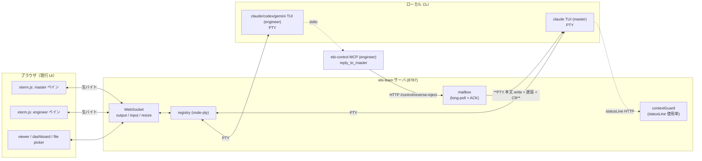
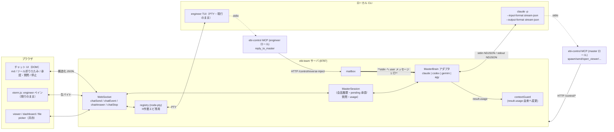
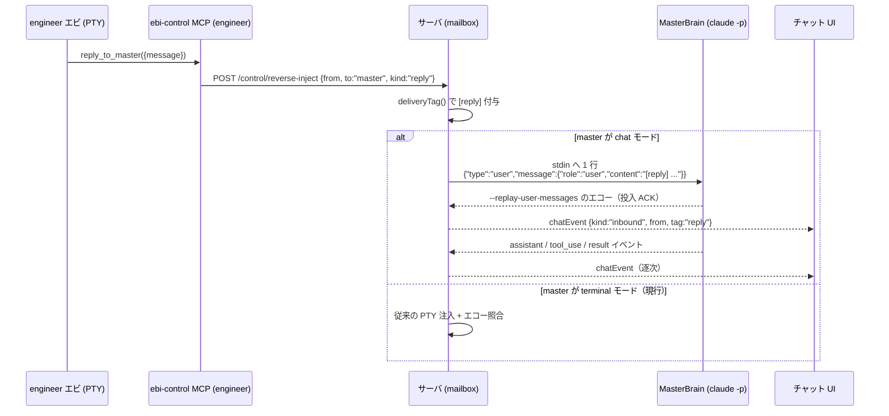
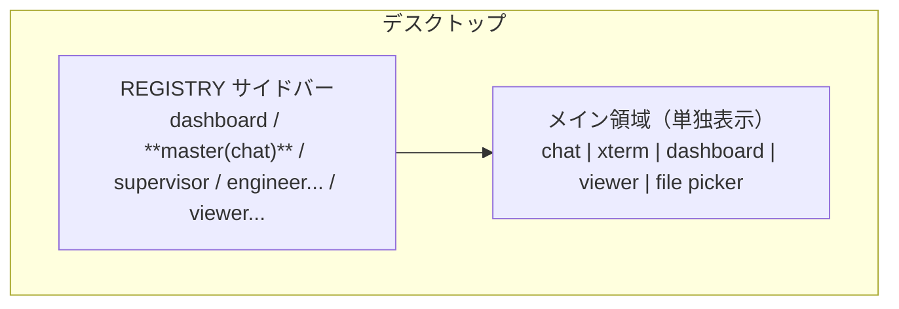

# master を「専用チャット UI + バックエンド非依存のヘッドレス頭脳」に作り直す設計

- 作成: 2026-09-05 engineer エビ（master 委譲・**設計のみ / 実装なし**）
- **r2: 2026-09-05 更新**（PR-M0 PoC の実測とボス裁定を反映。PR-M1 実装と同じ PR で改訂）。
  変更点の一覧は §0.1。実測の一次資料は `docs/poc/master-headless-poc-2026-09-05.md`
- ブランチ: `ebi/ebiteam-master-chat-ui-design` → r2 は `ebi/ebiteam-master-chat-m1`
- 前提資料: `docs/multibackend-plan-r2.md` / `docs/backends/codex.md` / `docs/backends/gemini.md` /
  `docs/research/antigravity-cli-2026-09-05.md`（別ブランチ `772bd06`）/
  `docs/research/master-quota-claude-pro-2026-09-05.md`（別ブランチ `998bd51`）
- ボス方針（2026-09-05）: 「今の ebi-team は CLI の動作をそのまま画面に写しているので PTY に頼らざるを得ない。
  master だけは ChatGPT のような対話型 UI で作り直し、master への返信(reply_to_master)を独自機能として実装し、
  すべての AI モデルから受付可能にしたい」
- 絶対条件: **サブスク枠を外れない**（Agent SDK / API 直叩き禁止）・作業エビ（engineer 等）は現行 PTY 表示のまま・既定は claude

---

## 0. 結論（12 行）

1. **成立する。** `claude -p --input-format stream-json --output-format stream-json` は「1 プロセスで多ターン」を
   公式にサポートし、`--mcp-config` / `--resume` / `--permission-prompt-tool` / `--replay-user-messages` まで揃う。
   ローカル実測（claude **2.1.258**）で全フラグの存在を確認済み。
2. **サブスク枠の担保は「`--bare` を使わないこと」の 1 点に集約できる。** 公式 docs が
   「bare mode doesn't use your subscription login」「In bare mode, Claude Code never reads OAuth credentials or the
   system keychain」と明記している＝**非 bare の `-p` は OAuth（サブスク）で走る**。§1.1 に根拠 URL。
   `ANTHROPIC_API_KEY` を master プロセスの env から**明示的に落とす**（`envDenyList` の master 版）ことで機械的に固定する。
3. **PTY 注入の廃止は「master だけ」で完結する。** 現行の master は `notifySubscribe:false`＝**受信を PTY 注入に固定**
   している（`ebi-team.config.example.json` の `_comment_master_receive`）。新方式では reply_to_master が
   mailbox → **master の stdin へ `{"type":"user",...}` を 1 行書く**だけになり、`--replay-user-messages` で
   投入 ACK が取れる。**配送ハードニング（エコー照合・PTY フォールバック）は master 経路では丸ごと不要**になる。
4. **UI は xterm を捨ててチャット DOM にする。** スマホでログがスクロールできない問題は
   「TUI をそのまま写している」ことに起因するので、DOM 化で**構造的に消える**（`overflow-y:auto` の通常スクロール）。
   ビューアパネル・ダッシュボード・file picker は現行の master-detail 構造にそのまま同居できる。
5. **backend 抽象は既存の `EbiBackend` とは別物にする。** `EbiBackend` は「PTY 起動引数の組み立て」の抽象で、
   新設する `MasterBrain` は「多ターン会話プロセスの制御」の抽象。**同居させると両方壊れる**ので別インターフェースにし、
   `ControlMcpSpec`（中立表現）だけを共有する。
6. **codex は技術的には最も素直（`codex app-server` の JSON-RPC が MasterBrain にほぼ 1:1 で射影できる）が、
   規約が引っかかる。** OpenAI 公式 auth docs が **"Use API key authentication for programmatic Codex CLI workflows,
   such as CI/CD jobs."** と明記。ChatGPT サブスク資格情報での**ヘッドレス常駐は明確なグレー**＝**ボス裁定が要る**（§1.2）。
7. **gemini は現行 CLI（0.58.0）では master になれない。** 実測で `--input-format` フラグが**存在しない**
   （`-o/--output-format` に `stream-json` はあるが**出力だけ**）。多ターン 1 プロセスは `--acp`（ACP JSON-RPC）経由に限られる。
   ボス方針の「gemini: -p + stream-json」という前提は**入力側について誤り**なので訂正する（§1.3）。
8. **agy（Antigravity CLI）は `--input-format stream-json` を公式に持つが、アカウントと ToS が入口で詰まる**
   （先行調査の結論どおり）。MasterBrain の射影表には載せるが、**実装は保留**（§1.4）。
9. **最大の設計リスクは「master の usage/context をどこから取るか」。** 現行 `contextGuard` は
   **master の statusLine（PTY 経由）** を唯一の入力にしているが、ヘッドレスに statusLine は無い。
   → stream-json の**ターン最後の `assistant` イベントの `message.usage`** と
    `result.modelUsage[model].contextWindow` から算出して載せ替える（§8-R3）。**r2 で PoC 済み・確定**。
10. **並存は feature flag 1 個で足りる。** `fixedEbi[].ui: "terminal" | "chat"`（既定 `terminal`）。
    chat のとき **PTY を一切起動しない**別ライフサイクルに分岐する。ロールバックは config を戻して再起動するだけ。
11. **PR は 8 本（各 ≤1 日）、必須 6.0〜7.5 日**。codex/gemini の MasterBrain は任意 PR で +2〜3 日（§9）。
12. **ボス裁定が要るのは 5 点**（§10）。うち最重要は「codex を master 頭脳に使うか（規約グレー）」と
    「長文脈 313k 中央値のヘッドレス resume 運用をどう切るか」。

---

## 0.1 r2 での変更（PR-M0 実測 + ボス裁定の反映）

**ボス裁定（2026-09-05・確定）**

| # | 裁定 |
|---|---|
| Q-1 | **codex も master 頭脳の対象に入れる**。既定は claude、codex は `brain:"codex"` 明示時のみの opt-in。規約グレーの点は docs に原文と URL を明記する |
| Q-2 | **gemini は対象外**（PR-M9 は切らない） |
| Q-3 | 長文脈は **「新しい会話」ボタン先行**（自動切断は入れない） |
| Q-4 | **ターミナル master は残す**（flag 併存） |
| Q-5 | **permissionMode は `auto` 継続** |
| Q-6 | **contextGuard の閾値は割合ベース（65/70/85%）で据え置き**（§5-D の再裁定要求への回答） |

**PoC 実測による設計の訂正（本文の該当節も書き換え済み）**

| # | 訂正 | 反映先 |
|---|---|---|
| A | `system/init` は**最初の user メッセージ送信後**にしか出ず、**毎ターン再送**される。init 待ちで ready 判定するとデッドロックする | §3.1 `start()` / §4.3 |
| B | 起動直後に SessionStart hook の `system/hook_started` `system/hook_response` が巨大本文で流れる。**未知の `system.subtype` は捨てる** | §4.3 |
| C | contextGuard の入力は `result.usage` では**なく**「ターン最後の `assistant` の `message.usage`（input + cache_read + cache_creation）」÷「`result.modelUsage[model].contextWindow`」。`result.usage` はターン内 API リクエストの合計で**非単調** | §3.1 `MasterUsage` / §8-R3 |
| D | opus-5 の文脈窓は **1,000,000**。65/70/85% は 200k 窓前提の数字だったが、**割合据え置き**（Q-6）。到達点が変わることを README に注記する | §8-R3 / §10 Q-6 |
| E | `total_cost_usd` は**プロセス単位**の積算で `--resume` すると 0 に戻る。累計はサーバ側でプロセスを跨いで足す（`MasterCostLedger`） | §3.1 / §8-R1 |
| F | busy 中の投入は**キューされず走行中ターンに合流**する（`queued_turn_count` は 0 のまま）＝「待機 N 件」UI は不要。replay ACK は `tool_result` も同じ `type:"user"` で流れるので **text ブロック一致で照合し tool_result を弾く**。ACK は即時でない（3.4s / 4.7s）ので**短いタイムアウトで再送しない** | §2.3 / §5.2 |
| G | 中断は SIGINT ではなく **`control_request` の `interrupt`（stdin 1 行・実測 19ms）**。直後の `result` は `is_error:true` / `subtype:"error_during_execution"` / `terminal_reason:"aborted_streaming"` で来るので、**通常エラー通知に化けさせない分岐**（`turnEnd.aborted`）を入れる | §3.1 / §8-R8 |
| H | **CLI の既定モデルは opus ではない**（実測 `claude-fable-5-1`）ので `--model opus` を明示する。`--strict-mcp-config` でも ebi-control は connected になり、`--dangerously-load-development-channels` は**不要** | §3.2 |
| I | `system/init.apiKeySource` が **`"none"`** を返す＝サブスク OAuth のプロセス自己申告。**`none` 以外なら起動拒否**（`--bare` 拒否 + env deny に加えた三重目の歯止め） | §1.1 / §8-R2 |
| J | codex: `turn/start` の `input` は**配列**、`turn/steer` は `expectedTurnId` 必須、item は `item.type`、最終回答は `agentMessage` かつ `phase === "final_answer"` | §3.2 |
| K | 枠（レート制限）の可視化は**バックエンド依存**。codex は `account/rateLimits/updated` で 5h / 週次と `planType` が取れるが、claude 頭脳では取れない | §5.2 |

**PR-M1 で実装したもの（本 PR）**: `src/server/master/`（`brain.ts` 抽象 / `claudeArgs.ts` 引数・env deny・preflight /
`claudeEvents.ts` NDJSON 正規化 / `claudeBrain.ts` 実装 / `codexBrain.ts` stub）＋ unit 50 本
＋ opt-in 結合スクリプト `scripts/e2e-master-brain.mjs`（既定では走らせない）。
サーバ本体からは**まだ 1 箇所も呼ばれていない**（外形ゼロ差分）。UI 配線は PR-M2。

---

## 1. サブスク枠の一次情報（各 CLI のヘッドレス公式サポートと認証）

「各社の公式 CLI をヘッドレスで抱える」方針が、**サブスク OAuth で公式に許されているか**を一次情報で確認した結果。

### 1.1 claude（Claude Code） — **公式サポート・サブスク OAuth で走る（＝採用）**

| 項目 | 一次情報 | 根拠 URL |
|---|---|---|
| 多ターン 1 プロセス | `--input-format` = `"Specify input format for print mode (options: text, stream-json)"` | https://code.claude.com/docs/en/cli-reference |
| ストリーム出力 | `--output-format stream-json`（NDJSON）・`--include-partial-messages`（`--print` + stream-json 必須） | 同上 / https://code.claude.com/docs/en/headless |
| 投入 ACK | `--replay-user-messages` = "Re-emit user messages from stdin back on stdout for acknowledgment (only works with `--input-format=stream-json` and `--output-format=stream-json`)" | `claude --help` 実測（2.1.258） |
| **サブスク認証** | **"Set `ANTHROPIC_API_KEY` before running it, because bare mode doesn't use your subscription login"** / **"In bare mode, Claude Code never reads OAuth credentials or the system keychain."** → **非 `--bare` の `-p` は OAuth＝サブスクで走る** | https://code.claude.com/docs/en/headless |
| MCP | `--mcp-config <configs...>` / `--strict-mcp-config`。`-p` と併用時は**未接続サーバの接続を待ってから 1 ターン目を走らせる**（`MCP_TIMEOUT` 既定 30s） | https://code.claude.com/docs/en/cli-reference |
| 承認 | `--permission-mode`（`default`/`acceptEdits`/`plan`/`auto`/`dontAsk`/`bypassPermissions`/`manual`）。`-p` の**既定は Manual**なので明示必須。`--permission-prompt-tool <MCP tool>` で承認を外部 UI へ回せる | https://code.claude.com/docs/en/headless |
| 質問（AskUserQuestion） | `--permission-prompts none` にすると **`AskUserQuestion` ツールが取り除かれる**。→ **master では none にしない**（既定 `host` のまま） | 同上 |
| セッション再開 | `--resume <id>` / `--session-id <uuid>` / `--fork-session` | https://code.claude.com/docs/en/cli-reference |
| コスト | `--output-format json` / `stream-json` の `result` に `total_cost_usd` と per-model 内訳（**client-side estimate**） | https://code.claude.com/docs/en/headless |
| 中断 | `SIGTERM` は exit 143 で**ターンを未完のまま残す**。ターンを終わらせたいなら **SIGINT**、または Agent SDK の `interrupt()`。`system/init` の `capabilities` に `interrupt_receipt_v1` 等 | 同上 |

> **注意（最重要の運用ルール）**: master 起動時に **`--bare` を絶対に付けない**。付けた瞬間、サブスク OAuth を読まなくなり
> `ANTHROPIC_API_KEY` 経由の**従量課金**（月 $7,000 級／`docs/research/master-quota-claude-pro-2026-09-05.md`）に落ちる。
> 逆に `ANTHROPIC_API_KEY` が env に残っていると bare 以外でも API 経路を掴む余地があるため、**master の spawn env から明示 deny する**。

### 1.2 codex（Codex CLI） — **技術は最適・規約はグレー（要ボス裁定）**

| 項目 | 一次情報 | 根拠 URL |
|---|---|---|
| 多ターン JSON-RPC | `codex app-server`（既定 stdio・NDJSON の JSON-RPC 2.0）。`thread/start` / `thread/resume` / `thread/fork` / `turn/start` / `turn/steer` / `turn/interrupt`、通知 `turn/started` / `item/started` / `item/agentMessage/delta` / `item/commandExecution/outputDelta` / `turn/completed` | https://learn.chatgpt.com/docs/app-server |
| 承認 | `item/commandExecution/requestApproval` / `item/fileChange/requestApproval` に対し client が `accept` / `acceptForSession` / `decline` / `cancel` を返す | 同上 |
| MCP | `mcpServerStatus/list` / `config/mcpServer/reload` / `mcpServer/elicitation/request` | 同上 |
| one-shot | `codex exec --json`（JSONL）。多ターンは `codex exec resume`。実測（0.146.0）で `--json` / `--output-schema` / `resume` サブコマンドを確認 | `codex exec --help` 実測 |
| **サブスク認証** | **"Use API key authentication for programmatic Codex CLI workflows, such as CI/CD jobs."** / access token は "intended for trusted scripts, schedulers, and private CI runners" / headless は `codex login --device-auth`（beta） | https://developers.openai.com/codex/auth （→ https://learn.chatgpt.com/docs/auth へ 308） |
| 実験ステータス | `codex app-server` は `--help` 上で **`[experimental]`** 表記 | `codex app-server --help` 実測（0.146.0） |

> **判定**: 「ChatGPT サブスク資格情報で app-server を常駐させて master を回す」は、**公式が推奨していない使い方**である。
> 禁止条項ではないが「programmatic には API キーを使え」と名指しで書かれている以上、
> **ボスが規約リスクを引き受けるかの裁定が要る**（§10 Q-1）。engineer エビの PTY 運用（人が対話する CLI の自動化）とは
> 性質が違い、こちらは**明示的に programmatic**なので言い訳が効かない。

### 1.3 gemini（Gemini CLI 0.58.0） — **master には不適（多ターンヘッドレス不可）**

実測（`gemini --help` / 0.58.0）:

```
  -p, --prompt              Run in non-interactive (headless) mode with the given prompt.
  -i, --prompt-interactive  Execute the provided prompt and continue in interactive mode
  -o, --output-format       [choices: "text", "json", "stream-json"]
  -r, --resume              Resume a previous session. Use "latest" ...
      --approval-mode       default | auto_edit | yolo | plan
      --experimental-acp    Starts the agent in ACP mode (deprecated, use --acp instead)
```

- **`--input-format` が存在しない**。`stream-json` は**出力形式のみ**。公式 headless docs にも入力側の記述は無い
  （https://github.com/google-gemini/gemini-cli/blob/main/docs/cli/headless.md — JSONL イベントは `init`/`message`/`tool_use`/`tool_result`/`error`/`result`）。
- したがって多ターンを 1 プロセスで流す手段は **`--acp`（Agent Client Protocol・stdio JSON-RPC）**のみ。
  `--experimental-acp` は deprecated 表記で `--acp` へ移行済み。
- 代替（毎ターン再起動 `-p` + `-r latest`）は、**master の中央値 313k 文脈を毎ターン読み直す**ことになり、
  レイテンシとレート枠の両面で非現実的。
- **ボス方針の「gemini: -p + stream-json」は入力側について成立しない。** ここは訂正が要る。

### 1.4 agy（Antigravity CLI） — **技術は満たすが入口が塞がっている（保留）**

- `-p` / `--print` / `--prompt`、`--output-format text|json|stream-json`、**`--input-format stream-json`
  （"to maintain a single, continuous conversation process"）** を公式に持つ（https://antigravity.google/docs/cli/headless/）。
  入力イベントは `{"event":"user","message":{"content":"..."}}`、出力は `init` / `step_update` / `result`。
- 認証: "Headless mode uses your cached credentials. Authenticate once with an interactive `agy` session first."（同上）
- ただし **ボスの活性垢は Workspace**（Antigravity は個人 Google 垢限定）、個人 Gmail 経路は ToS の
  third-party 条項と紙一重、API キー経路は従量課金 —— `docs/research/antigravity-cli-2026-09-05.md` の結論どおり
  **現時点では採用しない**。射影表には載せるが実装 PR は切らない。

### 1.5 まとめ（master 頭脳の採否）

| backend | 多ターン ヘッドレス | サブスク OAuth で公式に可か | master 採否 |
|---|---|---|---|
| **claude** | ✅ `-p --input-format stream-json --output-format stream-json` | ✅ 非 `--bare` は OAuth を読む（docs 明記） | **既定・第一実装** |
| **codex** | ✅ `codex app-server`（experimental） | ⚠️ 公式は「programmatic には API キー」＝**グレー** | **任意 PR・ボス裁定後** |
| **gemini** | ⚠️ `--acp` のみ（`--input-format` 無し） | ✅ OAuth personal（現行運用どおり） | **当面なし**（ACP 実装は別途） |
| **agy** | ✅ `--input-format stream-json` | ⚠️ 個人垢限定・ToS グレー・要新規ログイン | **保留** |

---

## 2. アーキテクチャ

### 2.1 現行（PTY にすべてを載せている）



**痛点**: ① master への配送が「入力欄に文字をタイプする」という物理エミュレーション（エコー照合・遅延チューニング・
二重配送ガードが必要）② UI が alt-screen 前提でスマホでスクロールできない ③ ツール実行/承認/質問が
「画面に出た文字」でしかなく、構造化されていない ④ usage は statusLine という別経路の HTTP POST に依存。

### 2.2 新（master のみヘッドレス化・作業エビは不変）



**変わるもの**: master の起動（PTY → 子プロセス stdio）・master への配送（PTY 注入 → stdin JSON）・
master の UI（xterm → チャット DOM）・master の usage 取得元（statusLine → result イベント）。
**変わらないもの**: 作業エビの PTY / xterm / 起動ゲート / idle 検出 / 配送ハードニング / worktree / viewer / file picker。

### 2.3 reply_to_master の新しい流れ（PTY 注入の廃止）



- **`--replay-user-messages` が「届いた」の一次証拠**になる。現行の「PTY へ書いた本文が画面にエコーされたか」という
  脆い照合（`src/shared/deliveryTag.ts` の不変条件）を、**プロトコル上の ACK に置き換えられる**。
- master が busy（ターン実行中）でも stdin へ書ける。**r2 実測（修正点 F）: キューではなく
  「走行中のターンに合流」する**（`result.queued_turn_count` は 0 のまま、同じターンの応答で
  割り込み内容を受領し、次ターンでも取りこぼさない）。→ 現行の「busy だと注入が滞留する」問題が
  消えるだけでなく、**「待機 N 件」という UI 概念そのものが不要**になる。
- **r2 実測: ACK は即時ではない**（起動直後 3.4s / 走行中割り込み 4.7s）。短いタイムアウトでの
  再送は二重投入になるので、**待つが再送はしない**設計にする。
- **r2 実測: replay には `tool_result` も同じ `type:"user"` で混ざる**。ACK 照合は
  「自分が投げた text ブロックと一致する user イベント」で行い、`tool_result` を弾くこと。

---

## 3. `MasterBrain` 抽象（backend アダプタ）

### 3.1 インターフェース案

```ts
// src/server/master/brain.ts（**r2: PR-M1 で実装済み。SoT は実ファイル側**）。
// 既存 EbiBackend（PTY 起動引数の抽象）とは**別物**。
// 共有するのは ControlMcpSpec（backends/types.ts）だけ。

export type MasterBrainId = "claude" | "codex" | "gemini" | "agy";

export interface MasterBrainStartOptions {
  cwd: string;
  model: string | null;
  /** 抽象 permissionMode（PERMISSION_MODES を再利用）。 */
  permissionMode: PermissionMode | null;
  /** 役割プロンプト（現行 fixedEbi[].appendSystemPrompt）。 */
  systemPrompt: string | null;
  /** 制御MCP の中立表現（backends/mcpSpec.ts で方言へ射影）。 */
  controlMcp: ControlMcpSpec | null;
  /** 再開したいセッション id（null なら新規）。 */
  resumeSessionId: string | null;
  /** 追加引数（config の args）。 */
  extraArgs: readonly string[];
}

/** UI へ流す正規化イベント（backend 非依存）。 */
export type MasterEvent =
  | { kind: "session";   sessionId: string; model: string | null;
      /** r2: init の自己申告。"none" 以外なら従量課金経路の疑いで起動拒否（修正点 I）。 */
      apiKeySource: string | null;
      mcpServers: {name:string;status:string}[]; capabilities: string[] }
  /** r2: 投入 ACK（--replay-user-messages）。tool_result と区別するため text 一致で照合する（修正点 F）。 */
  | { kind: "ack";       text: string }
  | { kind: "text";      text: string; partial: boolean }          // assistant 本文（partial=トークン差分）
  | { kind: "thinking";  text: string; partial: boolean }
  | { kind: "toolCall";  id: string; name: string; input: unknown }
  | { kind: "toolResult";id: string; ok: boolean; content: string }
  | { kind: "permission";id: string; toolName: string; input: unknown; suggestions?: string[] }
  | { kind: "question";  id: string; header: string; question: string; options: {label:string;description?:string}[]; multi: boolean }
  | { kind: "turnEnd";   ok: boolean;
      /** r2: ユーザー中断か（修正点 G）。true のとき UI は「中断しました」を出しエラー扱いしない。 */
      aborted: boolean;
      usage: MasterUsage | null;
      /** このプロセスの累積コスト。resume で 0 に戻るのでサーバ側で足し込む（修正点 E）。 */
      costUsd: number | null;
      errorText: string | null }
  | { kind: "notice";    level: "info"|"warn"|"error"; text: string }
  | { kind: "exit";      code: number | null; signal: string | null };

export interface MasterUsage {
  input: number | null; output: number | null;
  cacheRead: number | null; cacheCreation: number | null;
  /**
   * r2（修正点 C）: 文脈占有トークン = input + cache_read + cache_creation。
   * 供給源は **ターン最後の assistant イベントの message.usage**。
   * `result.usage` はターン内 API リクエストの合計で**非単調**なので使ってはならない。
   */
  contextTokens: number | null;
  /** 文脈窓。claude は result.modelUsage[model].contextWindow（opus-5 は 1,000,000）。 */
  contextSize: number | null;
  /** 文脈使用率(%)。算出できない backend は null（UI は「—」）。 */
  contextUsedPct: number | null;
}

export interface MasterBrain {
  readonly id: MasterBrainId;
  /**
   * 起動。resolve は「1 通目を受け付けられる」状態＝**プロセスが立って stdin が書ける**まで。
   * r2（修正点 A）: **`system/init` を待ってはいけない**。init は最初の user メッセージ送信後に
   * しか出ないため、init 待ちで ready 判定するとデッドロックする（実測: 2 分待っても出ない）。
   */
  start(opts: MasterBrainStartOptions): Promise<void>;
  /** ユーザー発話（およびエビからの reply）を投入する。 */
  send(input: { text: string; images?: {mediaType:string; base64:string}[] }): Promise<{ acked: boolean }>;
  /** 出力ストリーム。 */
  events(): AsyncIterable<MasterEvent>;
  /** 承認/質問への応答（permission / question の id に対して返す）。 */
  answer(id: string, decision: { allow?: boolean; choice?: string[]; note?: string }): Promise<void>;
  /**
   * 実行中ターンの中断（会話は殺さない）。
   * r2（修正点 G）: SIGINT / SIGTERM は使わない。stdin へ `control_request`（subtype:"interrupt"）を
   * 1 行書くだけで止まる（実測 19ms）。
   */
  interrupt(): Promise<void>;
  /** 再開に必要な id（プロセス落ち後の resume 用に MasterSession が永続化する）。 */
  sessionId(): string | null;
  /** 終了（SIGINT → 猶予 → SIGKILL）。 */
  stop(): Promise<void>;
  /** この backend が実装できない機能（UI が事前に灰色表示するため）。 */
  readonly unsupported: readonly (keyof MasterBrainCapabilities)[];
}

export interface MasterBrainCapabilities {
  partialText: boolean;      // トークン単位ストリーム
  thinking: boolean;         // 思考の可視化
  permissionPrompt: boolean; // 承認を UI に出せる
  askUserQuestion: boolean;  // 選択肢つき質問
  interrupt: boolean;        // ターン中断
  resume: boolean;           // セッション再開
  cost: boolean;             // コスト報告
  contextPct: boolean;       // 文脈使用率
  images: boolean;           // 画像入力
}
```

### 3.2 backend への射影表

| MasterBrain | **claude**（`-p --input-format stream-json`） | **codex**（`app-server` JSON-RPC） | **gemini**（`--acp`） | **agy**（`-p --input-format stream-json`） |
|---|---|---|---|---|
| `start()` | **r2（実測でそのまま通った列）**: `claude -p --input-format stream-json --output-format stream-json --verbose --replay-user-messages --mcp-config <path> --strict-mcp-config --permission-mode auto --append-system-prompt <role> --model opus`（**`--bare` は付けない** / **`--model` を明示**＝既定は opus ではない / `--include-partial-messages` は PoC 未検証なので PR-M3 で有効化 / `--permission-prompt-tool` は PR-M5 で追加） | `codex app-server` を spawn → `thread/start`（model / cwd / sandbox） | `gemini --acp`（ACP initialize → session/new） | `agy -p --input-format stream-json --output-format stream-json` |
| `send()` | stdin へ `{"type":"user","message":{"role":"user","content":"..."}}\n` | `turn/start {threadId, input}` / 実行中は `turn/steer` | ACP `session/prompt` | stdin へ `{"event":"user","message":{"content":"..."}}\n` |
| 投入 ACK | **`--replay-user-messages` のエコー** | JSON-RPC の `id` 応答 | JSON-RPC の `id` 応答 | 明示 ACK なし（`step_update` の到着で代用） |
| `text`（本文） | `assistant` メッセージの `text` ブロック | `item/agentMessage/delta` → `item/completed` | ACP `session/update`（agent_message_chunk） | `step_update` / `result` |
| `text` partial | ✅ `--include-partial-messages` の `stream_event`（`text_delta`） | ✅ `item/agentMessage/delta` | ✅ chunk | ⚠️ 未確認（`step_update` 粒度） |
| `thinking` | ✅ thinking ブロック（`--forward-subagent-text` でサブエージェント分も） | ⚠️ 未確認（reasoning item） | ⚠️ 未確認 | ❌ |
| `toolCall` / `toolResult` | ✅ `tool_use` / `tool_result` ブロック | ✅ `item/started` / `item/completed`（`commandExecution` 等）＋ `item/commandExecution/outputDelta` | ✅ `session/update`（tool_call） | ⚠️ `step_update` 内（構造は要確認） |
| `permission`（承認） | ✅ `--permission-prompt-tool` に指定した **MCP ツールへの呼び出し**として届く（ebi-control に `approve` を新設） | ✅ `item/commandExecution/requestApproval` / `item/fileChange/requestApproval` → `accept`/`acceptForSession`/`decline`/`cancel` | ✅ ACP `session/request_permission` | ❌（`--dangerously-skip-permissions` か policy 設定の二択） |
| `question`（AskUserQuestion 相当） | ✅ 通常の `tool_use`（`AskUserQuestion`）として stream に出る。**`--permission-prompts none` にすると消える**ので使わない | ⚠️ 相当機能なし（`mcpServer/elicitation/request` は MCP 由来のみ） | ⚠️ 相当機能なし | ❌ |
| `interrupt()` | ✅ **r2 実測: `control_request`（`{"type":"control_request","request_id":…,"request":{"subtype":"interrupt"}}` を stdin へ 1 行）で 19ms**。SIGINT / SIGTERM は不要。直後の `result` は `is_error:true` / `error_during_execution` / `terminal_reason:"aborted_streaming"` | ✅ `turn/interrupt`（`status:"interrupted"`） | ✅ ACP `session/cancel` | ⚠️ 未確認 |
| `resume` | ✅ `--resume <session_id>` / `--session-id <uuid>` / `--fork-session` | ✅ `thread/resume` / `thread/fork` | ✅ `-r latest`（ACP 経由の可否は要確認） | ⚠️ 未確認 |
| `cost` | ✅ `result.total_cost_usd`（client-side estimate） | ⚠️ `turn/completed` の usage（要確認） | ⚠️ `result.stats` | ⚠️ 未確認 |
| `contextPct` | ✅ **r2 確定**: 「ターン最後の `assistant` の `message.usage`（input + cache_read + cache_creation）」÷「`result.modelUsage[model].contextWindow`」。**`result.usage` は非単調なので使わない** | ❌ | ❌ | ❌ |
| `images` | ✅ content ブロックに `{"type":"image","source":{"type":"base64",...}}` | ✅ `turn/start` の input が images 対応 | ⚠️ 未確認 | ⚠️ 未確認 |

**対応不能／欠測の扱い（設計原則）**: `unsupported` に列挙し、**UI は該当機能を灰色 + ツールチップで「この backend は未対応」と明示**する。
黙って空欄にしない（既存の `reportsUsage=false` → 「—（未対応）」の方針を踏襲）。

### 3.3 permissionMode の射影（master 版）

| 抽象値 | claude | codex(app-server) | gemini(ACP) |
|---|---|---|---|
| `auto`（**master 既定・現行踏襲**） | `--permission-mode auto`（分類器が審査）＋ `--permission-prompt-tool`（残りは UI へ） | `thread/start` の approvalPolicy=`on-request` 相当 ＋ requestApproval を UI へ | `session/request_permission` を UI へ |
| `bypassPermissions` | `--permission-mode bypassPermissions` | sandbox `danger-full-access` ＋ approval `never` | `--yolo` 相当 |
| `plan` | `--permission-mode plan` | sandbox `read-only` | ACP + read-only |

> **`--permission-prompts none` は master では使わない。** none にすると `AskUserQuestion` が
> ツール一覧から除去され、「ボスに聞く」という master の中核機能が死ぬ（§1.1）。

---

## 4. MCP（ebi-control）の接続方法

### 4.1 中立表現は既存のものを流用する

`ControlMcpSpec`（`src/server/backends/types.ts`）と `mcpSpec.ts` の射影関数を**そのまま使う**。
master のヘッドレス化で新規に必要なのは「射影先が増えるか」だけで、**中立表現の SoT は 1 つのまま**。

| backend | 注入口 | 使う関数 |
|---|---|---|
| claude | `--mcp-config <path>`（JSON ファイル）＋ `--strict-mcp-config` | `toClaudeMcpConfig()`（既存・そのまま） |
| codex | `codex app-server` 起動時の `-c mcp_servers.<name>.*` | `toCodexConfigArgs()`（既存・そのまま） |
| gemini | env `GEMINI_CLI_SYSTEM_SETTINGS_PATH` に settings.json | `toGeminiSystemSettings()`（既存・そのまま） |
| agy | `~/.gemini/config/mcp_config.json` か workspace `.agents/mcp_config.json` | **新規射影が要る**（実装保留） |

### 4.2 `scripts/gen-master-mcp.mjs` の扱い — **役割を 1 段縮小する**

現状は「master 用 / engineer 用の claude 方言 JSON を `.ebi-team/` に生成し、サーバがそのパスを `--mcp-config` に渡す」。

新設計での変更点:

1. **生成物はそのまま維持**（`master-control(.dev).mcp.json` / `engineer-control(.dev).mcp.json`）。
   `npm run prestart` / `predev` のフックも変えない。**ヘッドレス master も `--mcp-config` にファイルパスを渡す形は同じ**なので、
   ここを壊す理由がない。
2. **ただし chat モードの master では `EBI_NOTIFY_SUBSCRIBE=off` を焼く。**
   現行 master は `notifySubscribe:false`（受信は PTY 注入）だが、chat モードでは受信が **stdin 投入**になるため、
   ブリッジの long-poll 購読は**どちらにせよ不要**。`master-control.chat.mcp.json` を別ファイルで生成するか、
   `applyMasterMcpConfig()` が chat モード時に env を差し替える（**後者を推奨** — 生成物を増やさない）。
3. **`--permission-prompt-tool` 用のツールを ebi-control（master ロール）に新設する**（§5.2）。
   これは `EBI_MCP_ROLE=master` のツールセットに 1 つ足すだけで、生成スクリプトは無変更。
4. **二重管理を作らない不変条件は維持**: `mcpSpec.ts` の純関数を経由しない方言 JSON を新たに手書きしない。

### 4.3 MCP 起動タイミング（既知の罠の再確認）

- claude は `-p` + `--mcp-config` のとき **未接続サーバの接続を待ってから 1 ターン目を走らせる**（`MCP_TIMEOUT` 既定 30s）。
  → PTY 時代の `readyWarmupMs`（TUI は入力を受けるが MCP 登録が終わっていない時間帯）という**ヒューリスティックが不要になる**。
- `system/init` イベントの `mcp_servers` / `mcp_server_errors` を見れば、**ebi-control が本当に載ったか**を
  プロトコル上で確認できる。→ **`MasterSession` は init で `ebi-control` が `connected` でなければ起動失敗として notice を出す**
  （codex の「静かな故障」= ツールが見えないまま会話を始める、を master でも構造的に防ぐ）。
- **r2 訂正 A（重要）**: その `system/init` は **「最初の user メッセージを送るまで出ない」**。
  実測で spawn 後 2 分待っても出なかった。したがって **ready 判定を init 待ちにしてはならない**
  （デッドロックする）。順序は `spawn → ready（stdin が書ける）→ 1 通目を送る → 初回 init で
  session_id と mcp_servers を確定` とする。init は**毎ターン再送**されるので、2 回目以降は捨てる。
- **r2 訂正 B**: 起動直後に SessionStart hook の `system/hook_started` / `system/hook_response` が流れ、
  本文はプラグインの skill 全文で 1 イベント数万字になる。**未知の `system.subtype` は捨てる**設計にし、
  UI へは流さない（`ClaudeStreamNormalizer` は `subtype !== "init"` を無条件で捨てる）。
- **r2 訂正 I**: init の `apiKeySource` が `"none"` なら **API キー無しの OAuth（サブスク）で走っている**
  ことのプロセス自己申告。`none` 以外なら起動失敗として扱う（`evaluateInitApiKeySource()`）。

---

## 5. UI 要件

### 5.1 レイアウト（既存の master-detail に 1 枚足すだけ）



- 現行 `src/client/main.ts` は「REGISTRY の 1 行を選ぶとメイン領域に 1 枚だけ出す」構造（`setActive`/`applyVisibility`）。
  **chat パネルはこの枚数に 1 枚加わるだけ**で、viewer / dashboard / file picker との共存は自動的に成立する。
- master 行はバッジを `💬`（chat モード）にして、terminal モードと区別する。

### 5.2 チャット表示

| 要件 | 実装方針 |
|---|---|
| md レンダリング | **`src/client/markdown.ts` を再利用**（依存ゼロ・DOM 非依存・`textContent` 描画で XSS 安全）。viewer.ts の DOM 構築を共通化して chat の assistant バブルに流用する |
| ツール実行の折りたたみ | `toolCall` / `toolResult` を 1 つの `<details>` にまとめる。サマリ行 = `🔧 <tool名> <1行要約>`、開くと input（JSON 整形）と result（先頭 N 行 + 「全部見る」）。**既定は閉じる**。実行中は `⏳`、完了で `✅`/`❌` |
| エビ返信の `[reply]`/`[idle]` | `inbound` イベントを**ユーザー発話とは別スタイルのバブル**（左寄せ・エビ絵文字・送信元 id 付き）で出す。`[reply]` = 実線ボーダー、`[idle]` = 破線 + 淡色（本文なしの合図）。`deliveryTag()` のタグをサーバ側で剥がして構造化フィールドに移す（UI に生タグを出さない） |
| 画像 / ビューア埋め込み | ① assistant が画像を出したら `` で inline ② `open_viewer` が呼ばれたら chat 内に**カード**（📄 タイトル + パス）を出し、タップでメイン領域を viewer に切り替える（現行の viewer 行選択と同じ遷移）。画像バイトは既存 `GET /control/viewer-file?id=` を流用 |
| 承認 UI | `permission` イベントで**バブル内にボタン 3 つ**（許可 / 今回だけ / 拒否）。未応答の間は入力欄上に「承認待ち 1 件」のスティッキーバー。応答は `chatAnswer` |
| **r2: 待機件数の表示** | **不要**（修正点 F）。busy 中の投入はキューされず走行中ターンに合流するため「待機 N 件」という状態が存在しない。`chatState.pending` は**未応答の承認/質問の件数**だけを意味する |
| **r2: 枠（レート制限）** | **バックエンド依存**（修正点 K）。codex 頭脳は `account/rateLimits/updated` で 5h / 週次の使用率と `planType` が取れるが、**claude 頭脳では機械可読な枠情報が出ない**（`rate_limit_event` は出るが値のスケールが未検証）。claude では「—（未対応）」表示にする |
| 質問 UI（AskUserQuestion） | `question` イベントで選択肢ボタン（`multi` なら複数選択 + 決定）。「その他」は自由入力欄にフォールバック |
| 途中停止 | 入力欄の送信ボタンが**ターン実行中は ⏹ に変わる**。押すと `chatStop` → `MasterBrain.interrupt()`。停止後は「中断しました」システム行を残す |
| 入力履歴 | ↑/↓ でローカル履歴（`localStorage`、直近 100 件・master セッション単位）。スマホは入力欄長押しで履歴ポップオーバー |
| コスト/文脈 | ヘッダに `$0.00 / ctx 31%` を常時表示（`turnEnd` の usage 由来）。**算出できない backend は「—」**。既存ダッシュボードとは二重表示になるが、master だけは手元に出す価値がある |

### 5.3 スマホ対応（既存の「ログがスクロールできない」問題の解消）

現行の症状は「master が xterm.js（TUI）で、ペイン内スクロールとページスクロールが競合する」ことに起因する。
chat 化で以下が**構造的に**解決する:

- チャットログは**通常の DOM ブロック**（`overflow-y:auto; -webkit-overflow-scrolling: touch;`）。
  `touch-action: pan-y` のような回避策も、Ctrl 武装バー（`key-assist`）も master では不要になる。
- **自動追従は「最下部にいるときだけ」**（`scrollTop + clientHeight >= scrollHeight - 32px` の判定）。
  ログを遡っている最中に新着で飛ばされない。飛ばされない代わりに「⬇ 新着 N 件」ピルを出す。
- 入力欄は `position: sticky; bottom: 0` ＋ `env(safe-area-inset-bottom)`。
  `visualViewport` の resize でソフトキーボード出現時に高さを詰める（iOS Safari 対策）。
- **タブ切替でのフォーカス自動付与はしない**（`pane.ts` の `isCoarsePointer()` と同じ方針を chat 入力欄にも適用）。
- 長いツール出力は `<details>` で畳まれているので、**スクロール距離そのものが短くなる**（副次的だが体感は大きい）。

### 5.4 WebSocket プロトコル追加（`src/shared/protocol.ts`）

```ts
// client → server
| { type: "chatSend";   id: string; text: string }                    // master へ発話
| { type: "chatAnswer"; id: string; requestId: string; allow?: boolean; choice?: string[]; text?: string }
| { type: "chatStop";   id: string }                                  // 実行中ターンの中断
| { type: "chatHistory";id: string; before?: number; limit?: number }  // 過去ログのページング

// server → client
| { type: "chatEvent";   id: string; seq: number; event: MasterEvent & { ts: number } }
| { type: "chatSnapshot";id: string; events: (MasterEvent & {ts:number; seq:number})[]; hasMore: boolean }
| { type: "chatState";   id: string; state: "starting"|"idle"|"busy"|"waiting"|"stopped"; pending: number }
```

- **`seq` は必須**（再接続時の欠落検出・`chatSnapshot` との突き合わせ）。既存 `scrollback` の
  「全部送ってから live を流す」順序保証と同じ規約を踏襲する。
- 既存の `output` / `input` / `resize` は**作業エビ専用として残す**（master が chat モードのときは master に対して飛ばない）。

---

## 6. 移行 / 切り替え

### 6.1 feature flag（1 個）

```jsonc
// ebi-team.config.json
{
  "fixedEbi": [
    {
      "id": "master", "kind": "master",
      "ui": "chat",            // ← 新設。"terminal"（既定・現行）| "chat"
      "brain": "claude",       // ← 任意。未指定は "claude"（master は claude 固定 fail-safe を継続）
      "model": "fable",
      "permissionMode": "auto",
      "args": ["--effort", "medium"]
    }
  ]
}
```

- `ui` 未指定 = `terminal` = **現行と完全に同じ経路**（`applyMasterBackendFailsafe` / `applyMasterMcpConfig` もそのまま）。
- `ui: "chat"` のとき `index.ts` の固定エビ起動が **PTY 経路をスキップして `MasterSession` を作る**。
  registry には `kind:"master"` のレコードを従来どおり載せる（UI が master 行を出すため）が、
  `pid` は MasterBrain の子プロセス pid、`status` は `chatState` から写す。
- env 上書き `EBI_MASTER_UI=terminal|chat` も足す（再起動だけで切り戻せるようにする）。

### 6.2 並存期間の運用

| 期間 | 構成 | 目的 |
|---|---|---|
| 第 1 段 | `ui:"terminal"`（既定）のまま、chat 実装は**サーバに載っているが未使用** | 回帰ゼロを確認（unit / 既存 e2e が全部 green） |
| 第 2 段 | ボスが手動で `EBI_MASTER_UI=chat` にして**別ポート**で起動し、稼働 8787 は terminal のまま | 実データで並行評価。8787 を触らない |
| 第 3 段 | 8787 を `ui:"chat"` に切替 | 本移行。問題が出たら config を戻して再起動（**1 手**） |

> **稼働サーバの反映手順は現行どおり**: `npm run build` → `node scripts/gen-master-mcp.mjs` → **ボスが再起動**。
> エビは稼働 dist / config / master-mcp を触らない（`docs/multibackend-plan-r2.md` R8）。

### 6.3 ロールバック

| 段 | 操作 | 効果 |
|---|---|---|
| 1 | `EBI_MASTER_UI=terminal`（env） | 再起動だけで現行 PTY master に戻る |
| 2 | config の `ui` を削除 | 恒久的に戻る |
| 3 | chat 系 PR のみ revert | 作業エビ側は無影響（chat PR は master 経路にしか触らない） |

### 6.4 e2e の再構成

| 既存スクリプト | 新方式での扱い |
|---|---|
| `e2e-master-channel.mjs`（master の channel 受信） | **chat モードでは対象外**。`ui:"terminal"` 用として残す |
| **新設 `e2e-master-chat.mjs`** | chat モード master を一時ポートで起動 → `chatSend` → `chatEvent` に text/turnEnd が来る → `reply_to_master` 相当を `/control/reverse-inject` で投げて **`inbound` イベントが出る**（＝ stdin 投入 ACK 経由）ことを確認。**連続 10 回 100%** を受け入れ基準にする |
| `e2e-spawn-delivery.mjs` / `e2e-delivery-hardening.mjs` | **エビ側の検証なので不変**。ただし宛先 master が chat のときのアサートを分岐させる（PTY エコー照合が走らないため） |
| `e2e-reverse-notify.mjs` / `e2e-notify-fallback.mjs` | 同上（master 宛の経路だけ分岐） |
| `e2e-context-guard.mjs` | **usage の入力元が変わるので改修必須**（statusLine POST → `turnEnd` の usage）。`/control/usage` は作業エビ用に残す |
| `e2e-control-mcp.mjs` / `e2e-send-message.mjs` / `e2e-viewer*.mjs` / `e2e-usage.mjs` | 無変更 |
| **新設 `e2e-master-chat-approval.mjs`** | `--permission-prompt-tool` 経由の承認往復（permission イベント → `chatAnswer` → ツール実行継続）。**要 PoC 後** |

---

## 7. 「すべての AI モデルから受付可能に」の意味づけ

ボス方針の「reply_to_master を独自機能として実装し、すべての AI モデルから受付可能にしたい」は、
**送信側（エビ）** と **受信側（master）** の 2 つに分解できる。

| 側 | 現状 | 新設計 |
|---|---|---|
| 送信（エビ → master） | **すでに全 backend で成立している**。ebi-control MCP は stdio + `EBI_ID` env + 127.0.0.1 HTTP だけに依存し、Claude 固有機能を使っていない（`docs/multibackend-plan-r2.md` §0-7） | 変更なし |
| 受信（master 側） | **Claude 固有だった**（`notifications/claude/channel` 注入 → 実害が出たので PTY 注入へ後退） | **完全に backend 非依存になる**。「MasterBrain.send() に user メッセージを 1 通渡す」という 1 本の口だけになり、claude / codex / gemini / agy のどれで master を回しても同じ経路 |

つまり **「reply_to_master を独自機能にする」＝「受信を harness の notification 機構に依存させない」** であり、
本設計の中核はここにある。PTY 注入も channel 注入も、どちらも harness 固有の裏口だった。
stdin への user メッセージ投入は **4 つの CLI すべてが公式に文書化している入り口**（§3.2 の `send()` 行）なので、
ここに一本化するのが最も筋が良い。

---

## 8. リスク

| # | リスク | 深刻度 | 対策 |
|---|---|---|---|
| **R1** | **サブスク OAuth がヘッドレス常駐で維持できるか未実証**。docs 上は非 bare の `-p` が OAuth を読むと明記されているが、**数日〜数週間 1 プロセスを生かし続けた実績がない**（トークン更新・レート枠のリセット跨ぎ） | **高** | **r2**: ①〜⑦は PR-M0 で実測 green（⑧24h 生存のみ継続観測中）。`total_cost_usd` は**プロセス単位**の積算で `--resume` すると 0 に戻る（修正点 E）ため、累計は `MasterCostLedger` がプロセスを跨いで足す。1 プロセスを 24h 以上生かして `result` の `total_cost_usd` が積算されるか／`api_retry` の `error: authentication_failed` が出ないかを観測。加えて **MasterSession に「プロセス死亡 → `--resume <sessionId>` で自動復帰」**を必ず入れる（PTY 時代の自動再起動と同じ役割） |
| **R2** | **`ANTHROPIC_API_KEY` の混入で静かに従量課金**（Gemini の `GOOGLE_CLOUD_PROJECT` 事故と同型） | **高** | master の spawn env に **deny list**（`ANTHROPIC_API_KEY` / `ANTHROPIC_AUTH_TOKEN` / `ANTHROPIC_BASE_URL` / `CLAUDE_CODE_USE_BEDROCK` / `CLAUDE_CODE_USE_VERTEX`）を適用。**deny 対象が env に残っていたら起動を拒否**する preflight（既存 `backendPreflight.ts` と同じ流儀）。`--bare` が args に含まれていたら**起動を拒否**する |
| **R3**（r2 解決） | **contextGuard が死ぬ**。現行は master の statusLine 使用率が唯一の入力（`contextGuard.ts` が `usage.id !== "master"` を無視）だが、ヘッドレスに statusLine は無い | **高** | **r2 確定（修正点 C）**: 「ターン最後の `assistant` の `message.usage`（input + cache_read + cache_creation）」÷「`result.modelUsage[model].contextWindow`」を `UsageStore` へ流す。`contextGuard` 側は入力インターフェースを変えずに済む。**`result.usage` は使わない**（使うと「65% 到達 → 次ターン 40%」のチャタリングが起きて通知が壊れる）。**閾値は割合据え置き（Q-6 裁定）**だが、opus-5 の窓は 1,000,000 で 65% = 650k のため現行の中央値 313k では到達しない点を README に注記する |
| **R4** | **長文脈（中央値 313k / p90 673k / 最大 993k）での resume が重い or 失敗する** | 中 | ① `--session-id` を ebi-team 側で採番して**再開先を確定的にする** ② 起動時に `--resume` が失敗したら**新規セッションで起動し、直前 N ターンの要約を 1 通目として投入**するフォールバック（要約は既存 supervisor に投げる） ③ `master-quota` 調査 §5 の削減策（`read_scrollback` 抑制・`ask_supervisor` 経由の要約・タスク境界での分割）を**チャット UI から 1 タップで打てる「新しい会話」ボタン**として実装 |
| **R5** | **codex の「静かな故障」が master でも起きる**（役割プロンプト ACK で「reply_to_master が使えない」と述べて以後動かない／`docs/backends/codex.md` §7.1） | 中 | master では `system/init` 相当（`mcpServerStatus/list`）で **ebi-control の接続を起動時にプロトコルで検証**し、未接続なら起動失敗にする。既存 `ackRespawn.ts` の文面監視は PTY 前提なので、**chat モードでは「ツールが見えているか」の構造的チェックに置き換える**（文面を疑うヒューリスティックを捨てられる＝改善） |
| **R6** | **`--permission-mode auto` 相当をヘッドレスでどう出すか**（承認が UI に出ずに黙って deny されると「動かない master」になる） | 中 | `--permission-mode auto` ＋ **`--permission-prompts` は既定 `host` のまま**（`none` にしない）＋ `--permission-prompt-tool mcp__ebi-control__approve` を必ず付ける。approve ツールはサーバの `MasterSession` に問い合わせ、**UI が応答するまで待つ**（タイムアウトは長めに取り、切れたら deny + notice）。**未応答の承認が 1 件でもあると master は止まる**ので、UI のスティッキーバー（§5.2）は必須要件 |
| **R7** | **stream-json の既知制限** | 中 | ① `--include-partial-messages` は `--print` + `stream-json` 必須 ② 消費が遅いと**最大 30 秒**出力ドレインを待って終了する（v2.1.214 以降。それ以前は約 2 秒で末尾が切れた）→ サーバ側は**背圧をかけずに読み切る**実装にする ③ piped stdin は 10MB 上限（**大きな貼り付けはファイル経由**に誘導する UI が要る） ④ サブエージェントのテキストは既定で流れない（`--forward-subagent-text` / v2.1.211+） |
| **R8**（r2 解決） | **中断の意味論**。`SIGTERM` はターンを未完で残し exit 143。誤って使うと会話が壊れる | 中 | **r2 確定（修正点 G）**: `interrupt()` は **stdin の `control_request`（subtype:"interrupt"）のみ**（実測 19ms・プロセスは生存し次ターンも通る）。プロセス終了は「stdin close → SIGINT → 3s → SIGKILL」。中断直後の `result` は `is_error:true` で来るので `turnEnd.aborted` に分岐し、**通常エラー通知に化けさせない** |
| **R9** | **codex の規約リスク**（§1.2） | 中 | **ボス裁定（Q-1）まで実装しない**。実装する場合も `brain: "codex"` を明示指定したときだけ動く opt-in にし、README に規約の原文と URL を書く |
| **R10** | **UI の再接続で会話が欠ける** | 低 | `seq` 単調増加 + `chatSnapshot` の `hasMore` ページング。サーバ側は master の会話イベントを **JSONL で永続化**（既存 `jsonlLog.ts` の流儀）し、再起動後も直近を復元できるようにする（PTY 時代は再起動で消えていたので**改善**） |
| **R11** | **チャット UI が xterm を捨てることで「生ログが見たい」需要が満たせない** | 低 | chat パネルに「生イベント」トグル（NDJSON をそのまま等幅表示）を置く。デバッグ時のみ使う |

---

## 9. PR 分割と工数

| PR | 内容 | 受け入れ基準 | 工数 | 依存 |
|---|---|---|---|---|
| **PR-M0** ✅完了 | **PoC（使い捨てスクリプト `scripts/poc-master-headless.mjs` のみ・本体無変更）**<br/>`claude -p --input-format stream-json --output-format stream-json --verbose --include-partial-messages --mcp-config <既存 master config> --strict-mcp-config --permission-mode auto --append-system-prompt <master 役割>` を spawn し、①多ターン往復 ②`--replay-user-messages` の ACK ③busy 中の追加投入がキューされるか ④`system/init` に ebi-control が載るか ⑤`result.usage` から文脈%が出せるか ⑥SIGINT 中断 ⑦`--resume` 復帰 ⑧24h 生存 を実測 | ①〜⑦が確認でき、⑧は少なくとも 6h 連続で `authentication_failed` が出ない | **1 日**（+ 放置観測） | ボス GO |
| **PR-M1** ✅完了 | **`MasterBrain` 抽象 + `ClaudeHeadlessBrain`**（サーバ内のみ・UI 未接続）。NDJSON パーサ・イベント正規化・env deny list・`--bare` 拒否 preflight・`apiKeySource` 検証。codex は interface + stub まで（Q-1 の opt-in） | 新規 unit 50 本 green（`test/masterBrain{Args,Events,Stream}.test.ts`）。既存 unit fail 0（合計 338）。`npm run build` 成功。**外形ゼロ差分**（既存ファイルの変更 0・サーバから未参照）。実プロセス結合は opt-in の `scripts/e2e-master-brain.mjs`（既定では走らせない＝サブスク枠を食わない） | **1 日** | PR-M0 |
| **PR-M2** | **`MasterSession` とサーバ配線**。feature flag `ui:"chat"`／PTY 経路の分岐／WS プロトコル拡張（`chatSend`/`chatEvent`/`chatState`/`chatSnapshot`）／会話 JSONL 永続化／mailbox → `send()` の載せ替え | `scripts/e2e-master-chat.mjs`：`chatSend` → `text`/`turnEnd`、`/control/reverse-inject` → `inbound` が**連続 10 回 100%** | **1 日** | PR-M1 |
| **PR-M3** | **チャット UI（表示のみ）**。md レンダリング（`markdown.ts` 再利用）・ツール `<details>`・`[reply]`/`[idle]` バブル・自動追従とスクロール・再接続復元 | 手動 UI 確認 + スクショ（`tmp/master-chat-ui/`）。スマホ幅（375px）でログが指スクロールできること | **1 日** | PR-M2 |
| **PR-M4** | **入力系**。送信・⏹ 停止（`interrupt()`）・入力履歴（↑/↓ / localStorage）・画像添付・大きな貼り付けのファイル誘導 | 停止で `turnEnd(ok:false)` が出て会話が継続できる。履歴が再読み込み後も残る | **0.5 日** | PR-M3 |
| **PR-M5** | **承認 / 質問 UI**。ebi-control（master ロール）に `approve` ツール新設 → `--permission-prompt-tool` 配線／`AskUserQuestion` の `tool_use` を選択肢 UI に／未応答スティッキーバー | `scripts/e2e-master-chat-approval.mjs`：承認往復でツール実行が継続する。未応答時に master が止まり、UI に待ち件数が出る | **1 日** | PR-M4 |
| **PR-M6** | **usage / context / cost**。`turnEnd.usage` → `UsageStore` → `contextGuard` の入力載せ替え。ヘッダのコスト・文脈%表示。算出不能 backend は「—」 | `e2e-context-guard.mjs` 改修版が green。statusLine 併走比較で文脈%の誤差が許容内（**PoC ⑤ の結果次第**） | **1 日** | PR-M2 |
| **PR-M7** | **移行と docs**。`EBI_MASTER_UI` env・ロールバック手順・e2e 再構成・README / `docs/backends/*.md` 追記・OSS 向け構成例 | 第 1 段（`ui` 未指定）で既存 e2e が全部 green。docs に規約の原文と URL が載っている | **0.5 日** | PR-M5 / PR-M6 |
| **必須合計** | | | **6.0〜7.5 日** | |
| **PR-M8**（Q-1 裁定済み・opt-in） | **`CodexAppServerBrain`**（`thread/*` `turn/*` `item/*` の射影・承認往復） | `brain:"codex"` で master が起動し、`e2e-master-chat.mjs` が 10/10 | 1.5 日 | **Q-1 裁定** |
| ~~**PR-M9**（任意）~~ | ~~**`GeminiAcpBrain`**（ACP JSON-RPC）~~ | **Q-2 裁定により切らない（対象外）** | — | — |

---

## 10. ボス裁定が要る点

| # | 論点 | 選択肢 | **推奨** |
|---|---|---|---|
| **Q-1**<br>**裁定: (b) opt-in で実装** | **codex を master の頭脳に使うか**。OpenAI 公式が「programmatic な Codex CLI ワークフロー（CI/CD 等）には API キーを使え」と明記しており、ChatGPT サブスク資格情報でのヘッドレス常駐は**規約グレー** | (a) 使わない（claude 専用） / (b) opt-in で実装し自己責任 / (c) API キーで実装（**従量課金**） | **(a) 当面使わない**。master は claude、GPT が要るときは engineer 側で codex を使う現行構成で十分。ボスが (b) を選ぶなら README に原文と URL を明記して opt-in にする |
| **Q-2**<br>**裁定: (a) 対象外** | **gemini を master 対象にするか**。現行 CLI（0.58.0）は `--input-format` を持たず、多ターンは `--acp` だけ | (a) 対象外 / (b) ACP で実装（+1.5 日） | **(a) 対象外**。Gemini CLI は Antigravity CLI へリタイア移行中（2026-06-18 移行期限）で、いま ACP に投資する価値が薄い |
| **Q-3**<br>**裁定: (c) 手動ボタン先行** | **長文脈（中央値 313k）の運用方針**。ヘッドレス 1 プロセス常駐だと文脈が単調増加し、コストの 78% を占める cache read が膨らむ | (a) 無制限（現行踏襲） / (b) 閾値超過で自動「新しい会話 + 要約引き継ぎ」 / (c) UI に手動ボタンだけ置く | **(c) を先に入れて (b) は後**。自動切断は文脈喪失の事故が怖い。まず contextGuard の通知 + 手動ボタンで運用し、実測後に (b) を検討 |
| **Q-4**<br>**裁定: (a) 残す** | **現行ターミナル master を残すか** | (a) 当面残す（flag 併存） / (b) chat 移行後に削除 | **(a) 当面残す**。§6.2 の 3 段移行が成立した後、1〜2 週間様子を見てから削除判断 |
| **Q-5**<br>**裁定: (a) `auto`** | **master の permissionMode**。現行 config は `auto` | (a) `auto` 継続（承認は UI へ） / (b) `bypassPermissions`（承認 UI 不要・速い） | **(a) `auto`**。承認 UI（PR-M5）は工数が要るが、「master が勝手に破壊的操作をしない」という現行の安全性を落とさない。(b) にすると PR-M5 を落とせて **-1 日** |
| **Q-6**（r2 で追加）<br>**裁定: (a) 据え置き** | **contextGuard の閾値**。opus-5 の文脈窓は **1,000,000** で、65/70/85% は 200k 窓の PTY master 前提の数字。1M 窓では 65% = 650k となり、現行の中央値 313k では**そもそも発火しない** | (a) 割合据え置き + README 注記 / (b) 絶対トークン数との二段構え | **(a) 割合据え置き**（ボス裁定 2026-09-05）。実運用の到達点が変わることを README に注記し、実測後に (b) を再検討する |

---

## 11. OSS 利用者向けの構成例

### 11-1. Claude のみ（推奨・既定）

```jsonc
{
  "defaultBackend": "claude",
  "fixedEbi": [
    { "id": "master", "kind": "master", "ui": "chat", "model": "fable", "permissionMode": "auto" },
    { "id": "supervisor", "kind": "supervisor", "model": "haiku", "permissionMode": "auto" }
  ]
}
```
必要なもの: Claude Pro / Max のサブスクと `claude` CLI のログイン。**`ANTHROPIC_API_KEY` は設定しない**（設定されていると preflight が起動を拒否する）。

### 11-2. GPT のみ（**Q-1 の裁定次第**）

```jsonc
{
  "defaultBackend": "codex",
  "backends": { "codex": { "command": "codex", "defaultModel": "gpt-5.5" } },
  "fixedEbi": [
    { "id": "master", "kind": "master", "ui": "chat", "brain": "codex", "model": "gpt-5.5" }
  ],
  "roles": { "engineer": { "backend": "codex" } }
}
```
注意: master 頭脳を codex にすると**規約グレー**（§1.2）。CI/private runner 用途では OpenAI は API キー / access token を案内している。

### 11-3. 混在（現実的な推奨形）

```jsonc
{
  "defaultBackend": "claude",
  "fixedEbi": [
    { "id": "master", "kind": "master", "ui": "chat", "brain": "claude", "model": "fable" }
  ],
  "roles": {
    "engineer":        { "backend": "claude", "defaultModel": "claude-opus-5" },
    "engineer-codex":  { "backend": "codex",  "defaultModel": "gpt-5.5" },
    "researcher":      { "backend": "gemini", "defaultModel": "gemini-flash-latest", "permissionMode": "plan" }
  }
}
```
master は claude（チャット UI）、実装は claude、セカンドオピニオンは codex、下調べは gemini。
**master 以外は現行の PTY 表示のまま**なので、既存ユーザーの見え方は変わらない。

---

## 付録 A: 本設計で実行したコマンド（読み取りのみ・稼働環境は無変更）

```
claude --version                 → 2.1.258
claude --help | grep -E "input-format|output-format|replay-user-messages|permission-prompt|resume|session-id|mcp-config"
codex --version                  → codex-cli 0.146.0
codex --help / codex exec --help / codex app-server --help
gemini --version                 → 0.58.0
gemini --help | grep -E "input-format|output-format|acp|resume|approval"   → --input-format は**存在しない**
git show 772bd06:docs/research/antigravity-cli-2026-09-05.md
git show 998bd51:docs/research/master-quota-claude-pro-2026-09-05.md
```

**CLI の実行（プロンプト送信）は一切していない**（課金・レート枠消費なし）。Chrome 拡張不使用。稼働サーバ（8787）不触。

## 付録 B: 一次情報 URL 一覧

- Claude Code ヘッドレス（`-p` / `--bare` と OAuth / stream-json / 承認 / SIGTERM）: https://code.claude.com/docs/en/headless
- Claude Code CLI リファレンス（`--input-format` / `--resume` / `--permission-prompt-tool` / `--mcp-config`）: https://code.claude.com/docs/en/cli-reference
- Claude Agent SDK ストリーミング入力（多ターン・キューイング・画像・割り込み）: https://code.claude.com/docs/en/agent-sdk/streaming-input
- Codex 認証（**"Use API key authentication for programmatic Codex CLI workflows, such as CI/CD jobs."** / device auth）: https://developers.openai.com/codex/auth （→ https://learn.chatgpt.com/docs/auth）
- Codex App Server プロトコル（`thread/*` / `turn/*` / `item/*` / requestApproval）: https://learn.chatgpt.com/docs/app-server
- Gemini CLI ヘッドレス（`-p` / `--output-format` の JSONL イベント・**入力側の記述なし**）: https://github.com/google-gemini/gemini-cli/blob/main/docs/cli/headless.md
- Antigravity CLI ヘッドレス（`--input-format stream-json` / cached credentials / CI 例）: https://antigravity.google/docs/cli/headless/
- Antigravity ToS（third-party software 条項）: https://antigravity.google/terms
- 社内先行調査: `docs/research/antigravity-cli-2026-09-05.md`（`772bd06`）/ `docs/research/master-quota-claude-pro-2026-09-05.md`（`998bd51`）/ `docs/multibackend-plan-r2.md`
